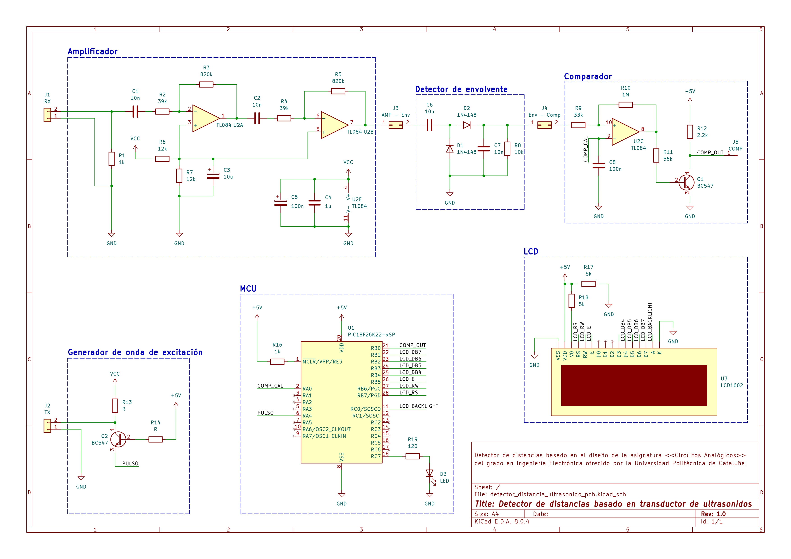

# Ultrasonic-based distance detector
In the following repo you'll find a brief explanation on the design, test and development of a simple distance detector based on ultrasonic transductors. This project was carried on along with a professor from Polytechnic University of Catalonia, as an improvement of an Analog Circuits subject's laboratory design.

